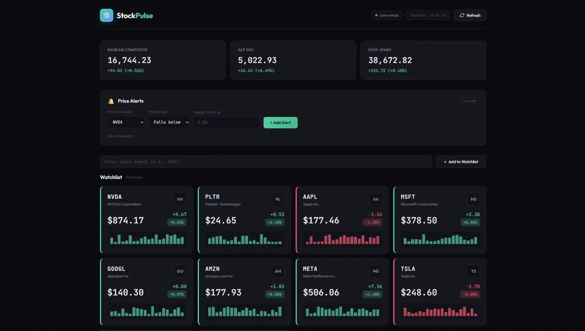

# StockPulse

A real-time stock price tracker with custom alerts, built with vanilla JavaScript. Track NASDAQ, S&P 500, Dow Jones, and your favorite stocks in a sleek dark-themed dashboard.



## Features

- **Real-Time Tracking** - Monitor stock prices with automatic updates every 30 seconds
- **Market Indices** - NASDAQ, S&P 500, and Dow Jones at a glance
- **Custom Watchlist** - Add/remove any stock symbol to your personal watchlist
- **Price Alerts** - Set alerts for when stocks rise above or fall below target prices
- **Audio Notifications** - Get notified when your price alerts trigger
- **Persistent Storage** - Your watchlist and alerts are saved locally
- **Responsive Design** - Works on desktop and mobile
- **Demo Mode** - Works out of the box with simulated data

## Quick Start

### Option 1: Just Open It
1. Download or clone this repo
2. Open `index.html` in your browser
3. That's it - the app runs in demo mode with simulated price data

### Option 2: Live Data with Finnhub API
1. Get a free API key from [Finnhub](https://finnhub.io/)
2. Open `index.html` in a text editor
3. Find `API_KEY: 'YOUR_API_KEY_HERE'` near the top of the script
4. Replace with your actual API key
5. Open in browser - you now have live stock data

## Live Demo

[https://reckedge.github.io/StockPulse](https://reckedge.github.io/StockPulse)

## Tech Stack

- HTML5
- CSS3 (Custom properties, Grid, Flexbox, animations)
- Vanilla JavaScript (ES6+, Fetch API, Web Audio API)
- JetBrains Mono + Outfit fonts
- Finnhub Stock API (optional)

## Project Structure

```
stockpulse/
├── index.html      # Main application (self-contained)
├── README.md       
├── LICENSE         
└── screenshot.png  
```

## Configuration

Edit the `CONFIG` object in `index.html` to customize:

```javascript
const CONFIG = {
    API_KEY: 'YOUR_API_KEY_HERE',     // Finnhub API key
    UPDATE_INTERVAL: 30000,            // Update frequency (ms)
    DEFAULT_STOCKS: ['NVDA', 'AAPL']   // Default watchlist
};
```

## Default Watchlist

The app comes pre-loaded with these stocks:
- NVDA (NVIDIA)
- PLTR (Palantir)
- AAPL (Apple)
- MSFT (Microsoft)
- GOOGL (Alphabet)
- AMZN (Amazon)
- META (Meta)
- TSLA (Tesla)
- AMD (AMD)
- NFLX (Netflix)

## How Alerts Work

1. Select a stock from your watchlist
2. Choose condition: "Falls below" or "Rises above"
3. Enter your target price
4. Click "Add Alert"
5. When the price crosses your target, you get a visual and audio notification

Alerts are automatically removed after triggering and persist across browser sessions.

## Browser Support

- Chrome (recommended)
- Firefox
- Safari
- Edge

## API Limits

Finnhub Free Tier:
- 60 API calls/minute
- Real-time US stock prices
- No credit card required

The app stays well within these limits with its 30-second update interval.

## License

MIT License - feel free to use this project however you'd like.

---

Made by [Reckedge](https://github.com/Reckedge)
